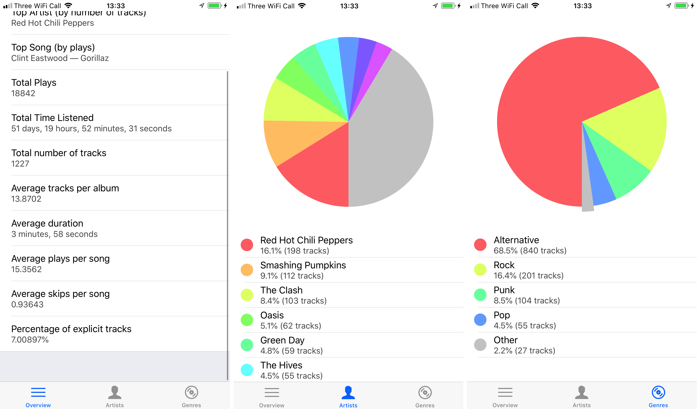

#  Music Stats

Music Stats is an iOS app which collects a load of data about your iTunes music library and gives you a number of "overview" stats, such as the total time you've listened to your music for or the percentage of your songs which are explicit, along with two pie charts showing the proportions of your library which are a particular artist or genre.

## Building it

There are a few prerequisites before you can build Music Stats:

 - Xcode
 - A code signing certificate (you can generate a personal one on Xcode)

Once you have all these things, clone the repository and open it in Xcode, then press run. I haven't tested it on the simulator, and I'm not sure how it would handle the music library unless you use an actual device, but it might do something - who knows.
